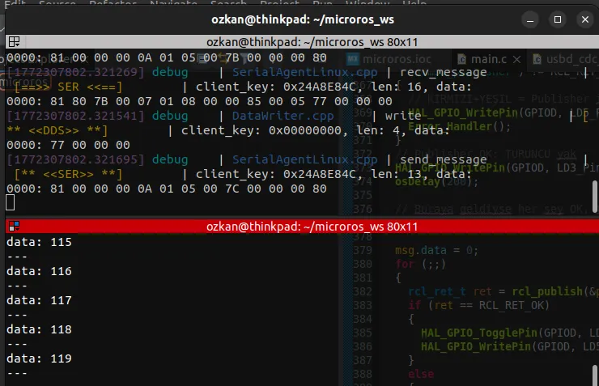

# STM32F407 + micro-ROS over USB CDC

A validated integration setup for connecting an STM32F407 target to ROS 2 Humble through micro-ROS and native USB CDC transport.

This repository records the configuration, host-side commands and troubleshooting steps used to establish the connection. It is intended as a concise engineering reference for STM32-to-ROS 2 bring-up.

## System Overview

    STM32F407
      └─ micro-ROS client
           └─ USB CDC (/dev/ttyACM0)
                └─ micro-ROS Agent
                     └─ ROS 2 Humble graph

## Tested Environment

- STM32F407 Discovery
- STM32CubeMX / STM32CubeIDE
- USB Device configured as CDC
- micro_ros_stm32cubemx_utils static library
- Ubuntu with ROS 2 Humble
- micro-ROS Agent using serial transport

## STM32 Configuration

1. Configure the STM32F407 system clock for 168 MHz using the 8 MHz HSE.
2. Enable USB OTG FS in Device Only mode.
3. Select the Communication Device Class (CDC) middleware.
4. Integrate the micro-ROS STM32CubeMX utilities and static library.
5. Configure the client transport for the USB CDC interface.

The USB device appears on Linux as /dev/ttyACM0 when enumeration succeeds.

## Host Setup

Install the micro-ROS Agent:

    sudo apt install ros-humble-micro-ros-agent

Add the current user to the dialout group:

    sudo usermod -aG dialout $USER

Log out and back in after changing group membership.

## Running the Agent

Start the agent before resetting the STM32 target:

    source /opt/ros/humble/setup.bash
    ros2 run micro_ros_agent micro_ros_agent serial --dev /dev/ttyACM0 -b 115200

Then reset the board. After the client connects, verify the ROS 2 topic:

    ros2 topic list
    ros2 topic echo /stm32_topic

## Validation

The following capture shows data received through the ROS 2 topic:

## Troubleshooting

### /dev/ttyACM0 is missing

Check USB enumeration and recent kernel messages:

    dmesg | grep tty
    ls -l /dev/ttyACM*

Verify the USB cable supports data and confirm that USB CDC is enabled in the firmware.

### Permission denied

Confirm that the user belongs to the dialout group:

    groups

If dialout was added recently, log out and back in before retrying.

### Agent does not connect

- Start the agent before resetting the board.
- Confirm that the selected serial device is correct.
- Ensure ROS_DOMAIN_ID is compatible with the rest of the ROS 2 system.
- Check that the STM32 clock configuration provides a valid 48 MHz USB clock.

## Scope

This repository documents the validated integration procedure and observed ROS 2 output. It serves as a reproducible bring-up reference for future STM32 and micro-ROS projects.

## Related Work

- [Dual BNO085 IMUs on a shared SPI bus](https://github.com/alcad1us/stm32-dual-bno085-shared-spi)
- [Dual BNO085 UART-RVC driver](https://github.com/alcad1us/stm32-dual-bno085-uart-rvc)
